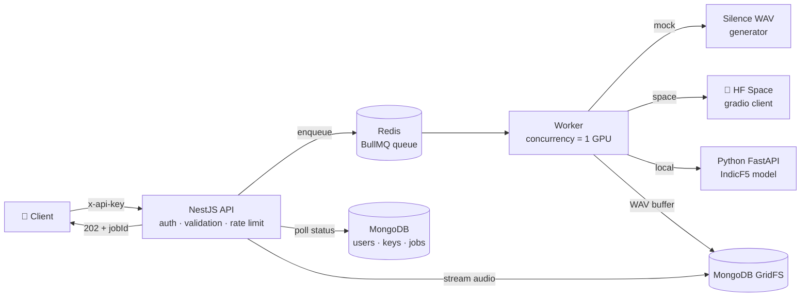
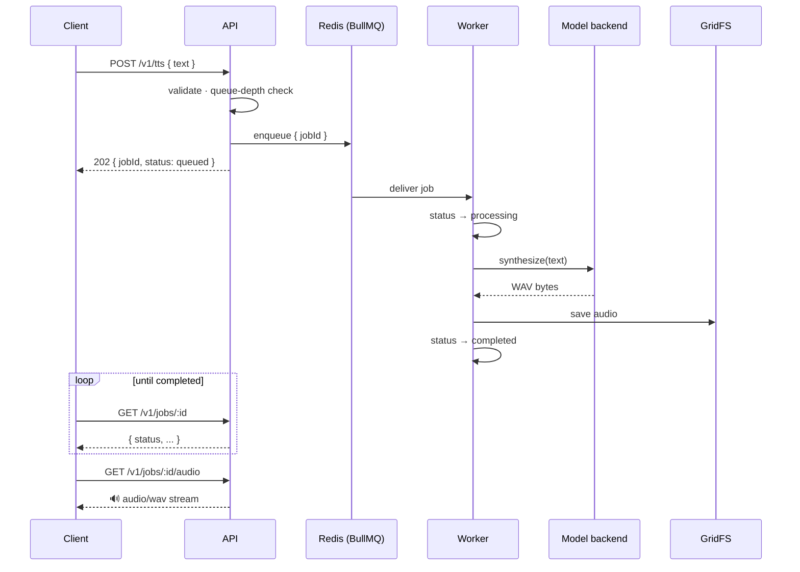

# 🎙️ IndicF5 Bengali TTS API

Production-minded backend service around the [ai4bharat/IndicF5](https://huggingface.co/ai4bharat/IndicF5) text-to-speech model: submit Bengali text, get back playable audio — built to stay responsive when many users hit a slow, GPU-bound model at once.

**Stack:** NestJS 11 (TypeScript, on Express) · MongoDB (Mongoose + GridFS) · Redis (BullMQ) · Python FastAPI model server · Jest + Supertest

---

## 🚀 Quick Start (zero ML setup)

```bash
git clone git@github.com:saminCSE/indicf5-tts-api.git
cd indicf5-tts-api
docker compose up -d --build
```

Open **http://localhost:3000/docs** (Swagger UI) →
`POST /v1/auth/register` → copy your API key → click **Authorize** → paste → try every endpoint from the browser.

Or with curl:

```bash
# 1. Register (key shown ONCE)
curl -X POST http://localhost:3000/v1/auth/register \
  -H "Content-Type: application/json" \
  -d '{"email":"you@example.com","name":"Reviewer"}'

# 2. Submit Bengali text
curl -X POST http://localhost:3000/v1/tts \
  -H "Content-Type: application/json" -H "x-api-key: <KEY>" \
  -d '{"text":"আমার সোনার বাংলা, আমি তোমায় ভালোবাসি।"}'
# → 202 { "jobId": "..." }

# 3. Poll
curl http://localhost:3000/v1/jobs/<jobId> -H "x-api-key: <KEY>"

# 4. Download when completed
curl -o out.wav http://localhost:3000/v1/jobs/<jobId>/audio -H "x-api-key: <KEY>"
```

> 💡 Default mode is **`mock`** — the full pipeline (auth → queue → worker → storage → download) runs with generated silent WAVs, no GPU or Python needed. For **real Bengali speech** see [Real inference](#-real-inference-two-options).

---

## 🏗️ Architecture



### Job lifecycle



**Why async job queue instead of handling in the request?** TTS inference is seconds-to-minutes and GPU-bound. Holding HTTP connections that long exhausts the server and trips gateway timeouts. Submissions return **202 in ~15ms**; a worker with `concurrency: 1` models the single GPU; clients poll. Under a burst, the queue absorbs — and past a depth cap the API **rejects explicitly** (`503` + `Retry-After`) instead of growing an unbounded backlog.

📈 **Proof under load** ([full report](docs/LOAD-TEST.md) — regenerable with the commands inside): 33,000 submissions in 10s → accepted jobs at p50 15ms, the rest rejected fast with 503, API responsive throughout; read path 1.8k req/s while the queue was saturated.

---

## 🔐 Multi-User Access & Isolation

- **Self-serve onboarding:** `POST /v1/auth/register` issues a `tts_live_…` API key — shown once, only its **sha256 hash** stored (sha256, not bcrypt: keys are 256-bit random, so slow hashing buys nothing and would break indexed lookup).
- **Key prefix pattern** (`tts_live_Xk3…`, Stripe-style): first 12 chars stored plaintext for identification, secret part only as hash.
- **Secure by default:** a global guard locks every endpoint; public routes opt out explicitly with `@Public()`. Forgetting a decorator fails **closed**.
- **Per-user isolation:** every job query filters by `{ _id, userId }`. A foreign job returns **404, not 403** — no existence leak. Covered by an e2e test where user B attempts to read user A's job.
- **Audio streams through the controller** (ownership check always runs) — never static-served.
- **Rate limiting:** custom Redis **sliding-window** guard (ZSET log) per user (per IP on public routes). `429` + `Retry-After`, with `X-RateLimit-Limit/-Remaining` on every response. Fails open on Redis outage — availability over strictness, logged loudly.

---

## 🎛️ TTS Backends — one interface, three implementations

Selected by `TTS_BACKEND` env var. Swapping = one line of config; the `TtsBackend` interface is the seam.

| Backend | What it does | When to use | Trade-off |
|---|---|---|---|
| `mock` *(default)* | Generates valid silent WAVs in-process | Tests, CI, reviewing the system without ML setup | No real audio |
| `space` | Calls the official HF Space via `@gradio/client` | Real audio without owning GPU infra | Shared infra: cold starts, rate limits, **currently broken upstream** (their Space can't auth to their own gated model — see note below) |
| `local` | HTTP to our own Python FastAPI model server (`worker/`) | Production path; verified: real Bengali speech in ~48s/job on Apple MPS | You own the infra + model ops |

> ⚠️ **On the broken Space:** the `space` backend code is correct and tested — the upstream demo Space itself is in `RUNTIME_ERROR`. Kept deliberately: it's one upstream fix away from working, costs nothing behind the interface, and it's the strongest argument in this repo for why the `local` backend exists. Never put someone else's free demo infra on your critical path.

## 🗣️ Real inference (two options)

Both need a free HF account with access granted to the gated [IndicF5 repo](https://huggingface.co/ai4bharat/IndicF5) + a Read token.

**Option A — Docker (Linux/CPU or NVIDIA):**
```bash
HF_TOKEN=hf_xxx TTS_BACKEND=local docker compose --profile real up -d --build
```

**Option B — bare metal (Apple Silicon gets MPS acceleration):**
```bash
cd worker
uv venv --python 3.10 .venv && source .venv/bin/activate
uv pip install -r requirements.txt "git+https://github.com/ai4bharat/IndicF5.git"
HF_TOKEN=hf_xxx uvicorn main:app --port 8000
# then run the API with TTS_BACKEND=local
```

First run downloads ~2GB of weights. Device auto-picks `cuda → mps → cpu` — same code path everywhere, only speed differs. Low-spec machine? Use `space`/`mock`; the device problem is solved by architecture, not hardware requirements.

**Voice note 🎤:** IndicF5 is voice-cloning TTS — a bundled reference voice (from the model's own prompts) defines *how* it sounds; your input text defines *what* it says (Bengali). Override with any 5–10s recording + its exact transcript via `REF_AUDIO_FILE`/`REF_TEXT`.

---

## 📚 API Reference

Interactive docs at **`/docs`** (Swagger UI, click-to-run). Summary:

| Method | Path | Auth | Purpose |
|---|---|---|---|
| `POST` | `/v1/auth/register` | — | Get an API key (shown once) |
| `GET` | `/v1/me` | 🔑 | Verify auth, see your identity |
| `POST` | `/v1/tts` | 🔑 | Submit Bengali text → `202` + jobId |
| `GET` | `/v1/jobs` | 🔑 | Your jobs, newest first, paginated |
| `GET` | `/v1/jobs/:id` | 🔑 | Job status/detail |
| `GET` | `/v1/jobs/:id/audio` | 🔑 | Download WAV (`409` until completed) |
| `GET` | `/v1/health` | — | Liveness + Mongo state |

**One envelope everywhere:** `{ success, statusCode, message, data, meta? }`; errors: `{ success: false, statusCode, message, error }`.

**Unhappy paths, deliberately mapped:** `400` invalid/unknown fields (whitelist + forbid) · `401` missing/bad key · `404` foreign or unknown job (incl. malformed ids) · `409` audio before completion / duplicate email · `413`-class via `400` on oversized text · `422` text with no Bengali characters · `429` rate limited + `Retry-After` · `503` queue saturated + `Retry-After`. Jobs that fail (model down, timeout) store the error and are visible via status — retried once with backoff first.

---

## ⚙️ Configuration

All env vars validated at boot — missing required vars **crash on startup with a named list** (fail fast, not mysteriously later). See [.env.example](api/.env.example).

| Var | Default | Purpose |
|---|---|---|
| `TTS_BACKEND` | `mock` | `mock` · `space` · `local` |
| `TTS_MAX_CHARS` | `1000` | Input length cap |
| `QUEUE_MAX_DEPTH` | `100` | Backpressure threshold → 503 |
| `JOB_TIMEOUT_MS` | `120000` | Per-job inference timeout |
| `RATE_LIMIT_PER_MINUTE` | `60` | Per user (per IP on public routes) |
| `TTS_SERVICE_URL` | `http://localhost:8000` | `local` backend target |
| `HF_TOKEN` | — | Required for `space`/`local` (gated model) |
| `BULL_PREFIX` | `bull` | Queue namespace — two workers sharing a Redis+prefix will compete for jobs |

## 🧪 Testing

```bash
cd api
npm test          # unit (backend HTTP client vs stub server)
npm run test:e2e  # 27 tests vs real Mongo + Redis: auth, jobs, isolation,
                  # rate limiting, backpressure — no mocks of infrastructure
```

TDD throughout — every feature's tests were written and seen failing before implementation. E2e suites run serially (`maxWorkers: 1`): they share real infrastructure.

## 📁 Structure

```
├── api/                       # NestJS service
│   ├── src/auth/              # register, api-key guard, decorators
│   ├── src/jobs/              # controller, service, BullMQ processor
│   │   ├── tts-backend/       # TtsBackend interface + mock/space/local impls
│   │   └── storage/           # AudioStorage interface + GridFS impl
│   ├── src/common/            # envelope interceptor, exception filter,
│   │   │                      # rate-limit guard, request logging
│   ├── src/database/          # Mongoose schemas + central model service, Redis client
│   └── test/                  # e2e suites (Supertest)
├── worker/                    # Python FastAPI model server (IndicF5)
└── docker-compose.yml         # api + mongo + redis (+ tts-model via --profile real)
```

## 🧠 Key Design Decisions & Trade-offs

1. **NestJS over raw Express** — it *runs on* Express; modules/guards/interceptors/DI make the architecture explicit and testable.
2. **Poll over SSE/webhooks** for job completion — simplest correct client contract; SSE is the natural upgrade and slots in behind the same job model.
3. **BullMQ over Kafka/RabbitMQ** — a heavy broker is unjustified for one work type; Redis is already in the stack for rate limiting.
4. **GridFS over local disk / S3** — disk fails multi-instance and ephemeral containers; S3 is the at-scale answer but adds reviewer setup. `AudioStorage` interface makes S3 a one-class swap.
5. **Worker in-process with the API** — one deployable now; extraction to a separate process is config, not surgery (BullMQ already decouples via Redis).
6. **Python model server behind HTTP** — the model is PyTorch + custom Python pipeline; no JS runtime exists. Business logic stays in Node; Python stays a stateless model box (the TorchServe/vLLM pattern).
7. **Fail-open rate limiting, fail-closed auth** — a Redis blip shouldn't take the API down; an auth doubt should always deny.
8. **ML dependency pins** (`transformers==4.48.*`, `pyarrow<15`, torchcodec+ffmpeg) — pin to the model's release era; latest ≠ compatible. Each pin earned by a real failure.

## 🔮 Production Roadmap (deliberately out of scope)

Daily per-user char quotas (same Redis pattern, daily TTL) · SSE job events · S3 storage driver · audio retention/cleanup job · Prometheus metrics + tracing (request-id plumbing exists) · separate worker deployable · CI pipeline (GitHub Actions: lint → build → e2e with service containers).

---

*Built for the As-Sunnah Foundation Senior Backend Developer assessment, July 2026.*
